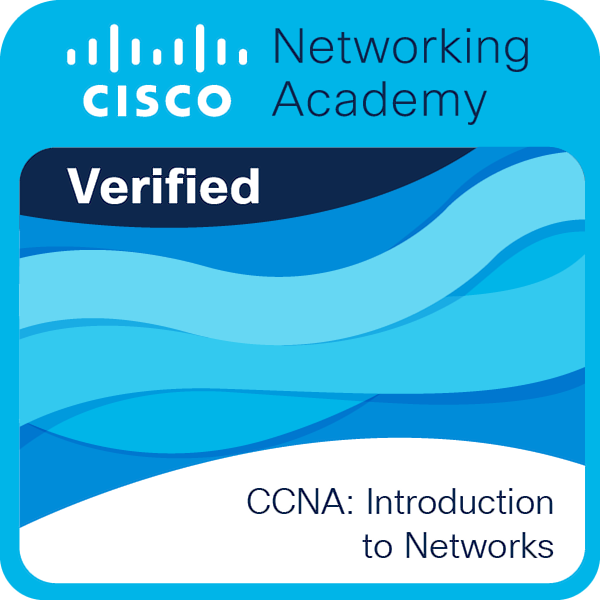
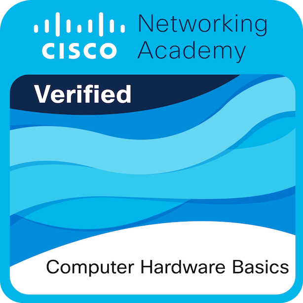

## Hello there! 👋

I'm Computer Science & Engineering student specializing in Networks and Systems Administration at the Higher Institute of Engineering of Coimbra.

  

---

### 📫 Connect with me

  

---

### 🏅 Cisco Certificates

  
  
  
  
  
  

---

### 🛠 Skills

  
  
  
  
  
  
  
  
  
  
  
  
  
  
  
  
  
  
  
  
  

---

### 📊 Stats

  

