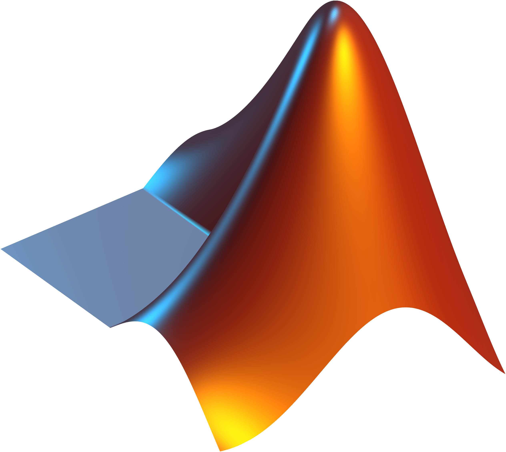

<h2 align="left">Hello there! I'm Rafael 👋</h2>

I'm a Computer Engineering student specializing in Networks and Systems Administration at the Higher Institute of Engineering of Coimbra.

  

<h3 align="left">Connect with me:</h3>

  

    <h2>Cisco Certificates</h2>
  

  	
	
	 

  

    <h2>Skills</h2>
  

  
  
  
  
  
  
  
  
  
  
   
  
   
  
  
  
  
  
   
  
   
  
  
  
  
  
  
  
  
  
  
  
  
  
  
  
  
  
  
  
  

  

    <h2>Stats</h2>
  

  
    
  

    
      
      
  

  

